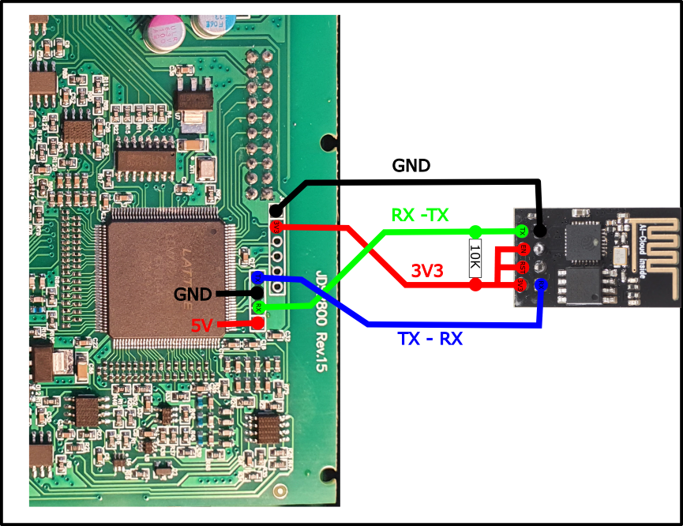
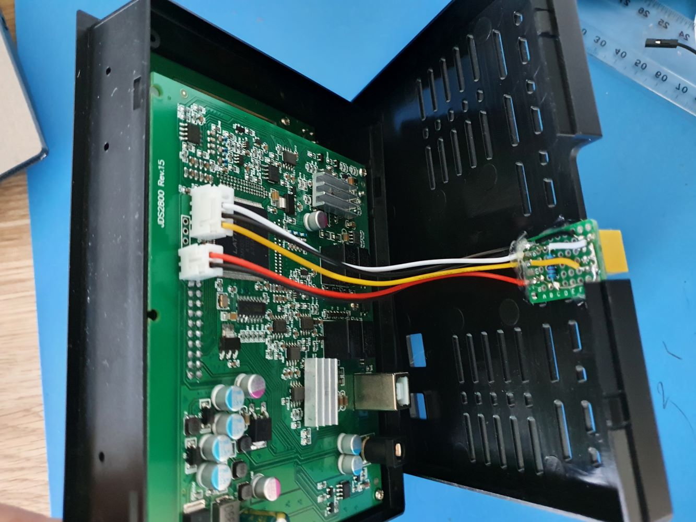

# espBode
Interface Diagram and setup between a Siglent oscilloscope and JDS2800 AWG

I have added support for the JDS2800 instructions, this may be applicable to similar units in the series that use a similar instruction set. 

The JDS2800 primarily has a USB interface, however the UART interface is exposed on an internal pin header.
Convieniently 3.3V is also available on a seperate header and the UART appears to operate at 3.3V. So far have not needed any external supply for ESP-01.

I still do find a few glitches in the trace occasionally for some unknown reason, maybe delay in transmission over wifi?

Tips:
 - System seems to like static IP addresses.
 - I required pull up resistor(10K) on the Tx line to get the ESP-01 to boot properly.
 - additional pull ups may be required to get ESP-01 to function in a stable state.
 

In my setup, I created a breakoutboard to enable the esp-01 to be plugged in and out as needed. 
I used connectors to attach the two boards so I can remove and/or access the pin headers in the future.

